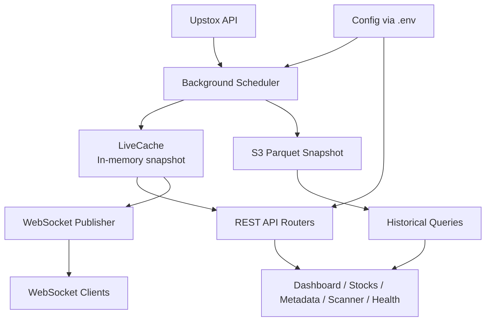
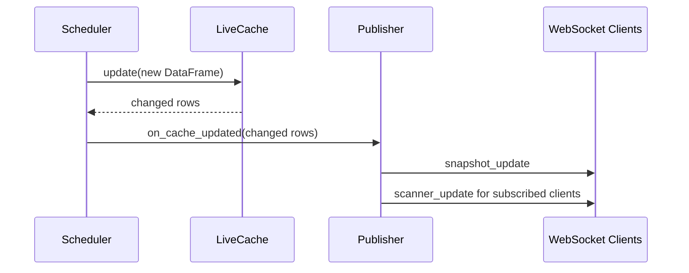

# MarketPulse Backend


Live market analytics backend for Upstox-powered equity snapshots, historical parquet queries, dynamic scanning, and WebSocket delta updates.

> **Verified scope:** this repository contains a Python FastAPI backend only. No frontend, database migration layer, Docker config, CI/CD workflows, or automated test suite is present in the workspace.

## Table of Contents

- [Hero Description](#hero-description)
- [Features](#features)
- [Screenshots](#screenshots)
- [Architecture Overview](#architecture-overview)
- [Project Structure](#project-structure)
- [Tech Stack](#tech-stack)
- [Getting Started](#getting-started)
- [Environment Variables](#environment-variables)
- [Available Scripts](#available-scripts)
- [API Documentation](#api-documentation)
- [Database](#database)
- [Authentication Flow](#authentication-flow)
- [State Management](#state-management)
- [Routing](#routing)
- [Configuration](#configuration)
- [Deployment](#deployment)
- [Performance Optimizations](#performance-optimizations)
- [Security](#security)
- [Logging](#logging)
- [Error Handling](#error-handling)
- [Testing](#testing)
- [Code Quality](#code-quality)
- [CI/CD](#cicd)
- [Contributing](#contributing)
- [Roadmap](#roadmap)
- [FAQ](#faq)
- [Troubleshooting](#troubleshooting)
- [License](#license)
- [Acknowledgements](#acknowledgements)
- [Maintainer](#maintainer)
- [Support](#support)
- [Contact](#contact)
- [Star History](#star-history)
- [Contributors](#contributors)
- [Future Improvements](#future-improvements)
- [Changelog](#changelog)
- [Version](#version)

## Hero Description

MarketPulse Backend exists to serve live and historical stock market data from a single backend surface. It solves the problem of having to combine real-time snapshots, historical parquet reads, market metadata, and scanner logic across separate tools.

It is designed for teams building market dashboards, stock scanners, analytics views, and intraday monitoring experiences on top of Upstox data. The backend keeps live data in memory for fast reads, streams updates over WebSocket, and reads historical data from S3-backed parquet files without requiring a database.

Primary benefits:

- Fast live reads from an in-memory snapshot.
- Realtime delta broadcasts over WebSocket.
- Server-side scanner evaluation for live and historical views.
- Dynamic column metadata so the frontend does not hardcode table structure.
- Historical queries with time filtering and minute-level timelines.

<details>
<summary>Repository reality check</summary>

- There is no frontend application in this workspace.
- There is no relational database schema or ORM layer.
- There are no Docker, Compose, GitHub Actions, or CI workflow files.
- There is no test suite in the repository.
- There is no license file in the repository.

</details>

## Features

### Live Market Data

- ✅ In-memory latest snapshot cache for live market data.
- ✅ Paginated, sortable, filterable stock listing.
- ✅ Single-stock detail lookup by instrument key or partial symbol.
- ✅ Dashboard endpoint that returns the full current snapshot.
- ✅ WebSocket delta broadcasts for changed rows only.
- ✅ WebSocket heartbeats to keep connections alive through proxies.

### Market Intelligence

- ✅ Market status detection for LIVE, CLOSED, HOLIDAY, and WEEKEND states.
- ✅ Market index feed for NIFTY 50, SENSEX, BANK NIFTY, MIDCAP, FINNIFTY, and INDIA VIX.
- ✅ Dynamic column metadata for frontend table builders and filters.
- ✅ Column override support for display names, groups, units, and descriptions.

### Historical Analytics

- ✅ Historical market data reads from S3 parquet files.
- ✅ Date filtering with optional intraday start and end time bounds.
- ✅ Minute-by-minute stock timeline for charting and analytics.
- ✅ Local disk cache for immutable historical parquet files.

### Scanner

- ✅ Server-side scanner evaluation against live or historical data.
- ✅ Predefined scanner presets for common strategies.
- ✅ Numeric, string, and range-based operators.
- ✅ AND / OR logic for multi-condition scans.
- ✅ Paginated scanner results.

### Operational Support

- ✅ Health endpoint for backend, scheduler, cache, S3, and market status.
- ✅ Environment-driven configuration via `.env`.
- ✅ Upstox login flow implemented in the background scheduler.
- ✅ S3 upload of daily parquet snapshots.

## Screenshots

This repository does not include frontend screenshots. Use these placeholders if you add a UI or documentation assets later:

- `/assets/screenshots/dashboard.png`
- `/assets/screenshots/stocks-table.png`
- `/assets/screenshots/stock-detail.png`
- `/assets/screenshots/history.png`
- `/assets/screenshots/timeline.png`
- `/assets/screenshots/scanner.png`
- `/assets/screenshots/metadata.png`
- `/assets/screenshots/market-status.png`
- `/assets/screenshots/websocket-live-update.png`

## Architecture Overview

MarketPulse uses a single-process FastAPI backend with a background scheduler and a shared in-memory cache.





### Backend

The backend is built with FastAPI and exposes REST endpoints under `/api/v1` plus a WebSocket endpoint at `/api/v1/ws`. Startup is handled through FastAPI lifespan events, which initialize the scheduler, attach the cache callback, and wire the event loop into the WebSocket publisher.

### Frontend

No frontend code exists in this repository. The backend is designed to be consumed by an external UI that can call the REST endpoints and subscribe to WebSocket messages.

### Database

There is no database layer in this repository. Live data is stored in memory, and historical data is read from S3 parquet files. The repository does not contain ORM models, migrations, or schema files.

### APIs

The backend exposes:

- REST endpoints for dashboard, stocks, history, scanner, metadata, market status, indices, and health.
- A WebSocket endpoint for live snapshot deltas and scanner subscriptions.

### Authentication

There is no user authentication for API consumers. The only authentication flow in the repository is the Upstox login flow used internally by the scheduler to obtain market data access tokens.

### Storage

- Live snapshot: in-memory DataFrame inside `LiveCache`.
- Historical data: S3 parquet files under the configured prefix.
- Local historical cache: temporary directory cache for non-today parquet files.
- Scanner presets and column overrides: JSON config files in `app/config`.

### Cache

Caching is implemented at multiple layers:

- LiveCache stores the current and previous snapshot for diff detection.
- Index data is cached for 60 seconds.
- Historical parquet files for past dates are cached on local disk.

### Deployment

No deployment manifests are included in the repository. The app is a standard ASGI application and can be launched with Uvicorn. WebSocket support and a single shared process are important because the scheduler, cache, and broadcaster are process-local.

## Project Structure

```text
backend/
├── app/
│   ├── main.py
│   ├── api/
│   ├── cache/
│   ├── config/
│   ├── schemas/
│   ├── services/
│   ├── storage/
│   └── websocket/
├── scheduler/
├── requirements.txt
└── .env.example
```

### Major Folders

| Path | Purpose |
| --- | --- |
| `app/main.py` | FastAPI application factory, lifespan management, middleware, router registration, and WebSocket endpoint. |
| `app/api/` | REST route handlers for dashboard, stocks, history, scanner, metadata, market status, and health. |
| `app/cache/` | In-memory live snapshot cache used by both the API and the scheduler thread. |
| `app/config/` | Environment settings, holiday calendar, scanner presets, and column display overrides. |
| `app/schemas/` | Pydantic models for responses, metadata, scanner requests, and stock query parameters. |
| `app/services/` | Business logic for market data, historical queries, scanner evaluation, column metadata, and index fetches. |
| `app/storage/` | Empty package in the current workspace. No storage implementation files are present beyond the package marker. |
| `app/websocket/` | Connection manager, message definitions, and broadcast bridge for live updates. |
| `scheduler/` | Upstox scheduler that logs in, fetches market data, enriches rows, uploads parquet snapshots, and notifies callbacks. |

## Tech Stack

| Area | Technology | Notes |
| --- | --- | --- |
| Frontend | Not included | No frontend code is present in this repository. |
| Backend | FastAPI | ASGI application with REST and WebSocket support. |
| Language | Python | Repository dependency set is Python-based. |
| DataFrame Engine | pandas | Used for live snapshot filtering, sorting, scanning, and serialization. |
| Historical File Format | Parquet | Read via PyArrow and pandas. |
| Cloud Storage | Amazon S3 | Stores ticker metadata and historical parquet snapshots. |
| Scheduler | APScheduler | Runs the background fetch and token refresh jobs. |
| Browser Automation | Selenium | Used in the Upstox login flow. |
| Authentication Helper | pyotp | Generates TOTP for the Upstox login flow. |
| HTTP Client | requests | Used for Upstox and index calls. |
| WebSocket | FastAPI / Starlette | Built into the ASGI stack. |
| Configuration | Pydantic Settings | Loads environment variables from `.env`. |
| Packaging | `requirements.txt` | No `pyproject.toml` or setup script is present. |
| Testing | Not configured | No test framework files are present. |
| Linting | Not configured | No formatter or linter configuration files are present. |

## Getting Started

### Prerequisites

- Python 3.x installed locally.
- Access to the Upstox credentials required by the scheduler.
- Access to the configured S3 bucket and parquet files.

> **Tip:** The app can boot without live data, but the scheduler will only fetch market data successfully when the Upstox and S3 credentials are valid.

### Installation

```bash
git clone <repository-url>
cd backend
python -m venv .venv
```

Activate the virtual environment, then install dependencies:

```bash
# Windows PowerShell
.\.venv\Scripts\Activate.ps1

# macOS / Linux
# source .venv/bin/activate

pip install -r requirements.txt
```

### Environment Variables

Copy `.env.example` to `.env` and fill in the required values:

```bash
# Windows PowerShell
Copy-Item .env.example .env

# macOS / Linux
# cp .env.example .env
```

### Run Development

```bash
uvicorn app.main:app --reload --host 0.0.0.0 --port 8000
```

### Run Production

```bash
uvicorn app.main:app --host 0.0.0.0 --port 8000
```

FastAPI docs are available at:

- `http://localhost:8000/api/docs`
- `http://localhost:8000/api/redoc`
- `http://localhost:8000/api/openapi.json`

## Environment Variables

All environment variables are defined in `app/config/settings.py` and mirrored in `.env.example` where applicable.

| Variable | Description | Required | Default |
| --- | --- | --- | --- |
| `UPSTOX_API_KEY` | Upstox OAuth client ID used by the scheduler login flow. | Yes for live data | Empty string |
| `UPSTOX_SECRET_KEY` | Upstox client secret used in the token exchange step. | Yes for live data | Empty string |
| `UPSTOX_CLIENT_ID` | Upstox mobile number or login identifier entered in the Selenium flow. | Yes for live data | Empty string |
| `UPSTOX_CLIENT_PIN` | Upstox PIN used after OTP validation. | Yes for live data | Empty string |
| `UPSTOX_TOTP_SECRET` | Secret used to generate the OTP via `pyotp`. | Yes for live data | Empty string |
| `UPSTOX_REDIRECT_URI` | Redirect URI used during Upstox authorization. | Yes for live data | `https://127.0.0.1:5000/` |
| `S3_BUCKET_NAME` | Bucket containing ticker metadata and parquet snapshots. | Yes for live/historical data | `rahul-upstox01` |
| `S3_TICKER_FILE_KEY` | Excel file key for the instrument list in S3. | Yes for live data | `Merged_Equities_BSE_NSE.xlsx` |
| `S3_PARQUET_PREFIX` | Prefix for historical parquet files in S3. | Yes for historical data | `equitydata` |
| `CORS_ORIGINS` | Allowed browser origins for CORS. | No | `http://localhost:3000`, `http://127.0.0.1:3000` |
| `FETCH_CHUNK_SIZE` | Number of instruments fetched per Upstox API call. | No | `490` |
| `SCHEDULER_ENABLED` | Enables or disables the background scheduler. | No | `True` |

> **Note:** `app/config/settings.py` also defines `API_HOST`, `API_PORT`, `MARKET_OPEN_HOUR`, `MARKET_OPEN_MINUTE`, `MARKET_CLOSE_HOUR`, `MARKET_CLOSE_MINUTE`, and `WS_HEARTBEAT_INTERVAL`, but the current runtime code does not read those values.

## Available Scripts

This repository does not define npm, yarn, pnpm, or Python task scripts in a `package.json` or task file.

Use the following direct commands instead:

```bash
uvicorn app.main:app --reload
pip install -r requirements.txt
```

## API Documentation

All REST endpoints are mounted under `/api/v1`.

### Response Envelope

Successful responses follow this shape:

```json
{
  "success": true,
  "timestamp": "2026-07-16T12:00:00",
  "market_status": "LIVE",
  "data": [],
  "meta": {
    "total": 0,
    "page": 1,
    "page_size": 50,
    "total_pages": 0
  }
}
```

Error responses follow this shape:

```json
{
  "success": false,
  "timestamp": "2026-07-16T12:00:00",
  "error": {
    "code": "NO_DATA",
    "message": "Market data not yet available.",
    "details": null
  }
}
```

### Endpoints

| Method | Path | Purpose |
| --- | --- | --- |
| `GET` | `/api/v1/dashboard` | Returns the full live snapshot for the initial dashboard load. |
| `GET` | `/api/v1/stocks` | Returns a paginated, filtered, sortable stock list. |
| `GET` | `/api/v1/stocks/{symbol}` | Returns one live stock record by instrument key or symbol. |
| `GET` | `/api/v1/history` | Returns historical parquet data for a date and optional time window. |
| `GET` | `/api/v1/history/dates` | Lists available historical dates in S3. |
| `GET` | `/api/v1/history/timeline/{symbol}` | Returns minute-level timeline data for one stock. |
| `POST` | `/api/v1/scanner` | Evaluates scanner conditions against live or historical data. |
| `GET` | `/api/v1/scanner/presets` | Returns predefined scanner configurations. |
| `GET` | `/api/v1/metadata` | Returns dynamic column metadata and groups. |
| `GET` | `/api/v1/columns` | Returns simple column names from the current snapshot. |
| `GET` | `/api/v1/market-status` | Returns current market state and market hours metadata. |
| `GET` | `/api/v1/indices` | Returns market index data fetched from Upstox. |
| `GET` | `/api/v1/health` | Returns backend, scheduler, cache, S3, and market status health. |
| `WebSocket` | `/api/v1/ws` | Streams live snapshot updates and scanner updates. |

### Query Parameters

#### `GET /api/v1/stocks`

- `page`: page number, starting at `1`.
- `page_size`: number of rows per page, up to `500`.
- `sort_by`: DataFrame column name.
- `sort_order`: `asc` or `desc`.
- `search`: partial match across instrument, trading symbol, and company name.
- `filters`: JSON-encoded filter object.
- `columns`: comma-separated column list.

#### `GET /api/v1/history`

- `symbol`: instrument key or partial symbol.
- `date`: `YYYY-MM-DD` or `today`.
- `start_time`: `HH:MM`.
- `end_time`: `HH:MM`.
- `page`: page number.
- `page_size`: page size.

#### `POST /api/v1/scanner`

- `mode`: `live` or `historical`.
- `conditions`: array of condition objects.
- `sort_by`: column to sort by.
- `sort_order`: `asc` or `desc`.
- `page`: page number.
- `page_size`: page size.
- `date`, `start_time`, `end_time`: used when `mode` is `historical`.

### Example Requests

```bash
curl http://localhost:8000/api/v1/health
```

```bash
curl "http://localhost:8000/api/v1/stocks?page=1&page_size=25&sort_by=Volume&sort_order=desc&search=INFY"
```

```bash
curl "http://localhost:8000/api/v1/history?symbol=INFY&date=today&page=1&page_size=100"
```

```bash
curl -X POST http://localhost:8000/api/v1/scanner \
  -H "Content-Type: application/json" \
  -d '{
    "mode": "live",
    "conditions": [
      {"column": "day_change_pct", "operator": ">", "value": 3, "logical": "AND"},
      {"column": "Volume", "operator": ">", "value": 500000, "logical": "AND"}
    ],
    "sort_by": "day_change_pct",
    "sort_order": "desc",
    "page": 1,
    "page_size": 50
  }'
```

### WebSocket Messages

The WebSocket endpoint accepts JSON messages with these client actions:

- `ping`
- `subscribe_scanner`
- `unsubscribe_scanner`

Server messages include:

- `connected`
- `snapshot_update`
- `market_closed`
- `scanner_update`
- `heartbeat`
- `error`

## Database

There is no database in this repository.

Current persistence model:

- Live snapshot data lives in memory inside `LiveCache`.
- Historical snapshots are read from S3 parquet files.
- Historical parquet files for past dates are cached locally in the system temp directory.

There are no ORM models, migration scripts, SQL schemas, or seed files.

## Authentication Flow

No end-user authentication or authorization flow is implemented for API clients.

The repository does implement an internal Upstox authentication flow for the scheduler:

1. Open the Upstox authorization dialog.
2. Submit the configured mobile/login identifier.
3. Generate a TOTP with `pyotp`.
4. Submit the configured PIN.
5. Capture the authorization code from the redirect URI.
6. Exchange the code for an access token.
7. Use the token for market quote and index requests.

## State Management

State is managed in-process using singletons and request-scoped access to app state.

- `LiveCache` stores the current and previous market snapshots.
- The scheduler updates `LiveCache` after each fetch cycle.
- WebSocket subscriptions are tracked per connection in the connection manager.
- Scanner subscriptions are stored per WebSocket connection.
- FastAPI `app.state` exposes the shared cache and scheduler to route handlers.

## Routing

All public API routes are mounted under `/api/v1`.

- `/api/v1/dashboard` - initial snapshot load.
- `/api/v1/stocks` and `/api/v1/stocks/{symbol}` - stock list and detail.
- `/api/v1/history`, `/api/v1/history/dates`, `/api/v1/history/timeline/{symbol}` - historical analytics.
- `/api/v1/scanner` and `/api/v1/scanner/presets` - scanning.
- `/api/v1/metadata` and `/api/v1/columns` - column discovery.
- `/api/v1/market-status` and `/api/v1/indices` - market context.
- `/api/v1/health` - operational health.
- `/api/v1/ws` - WebSocket stream.

FastAPI also exposes docs at `/api/docs`, `/api/redoc`, and `/api/openapi.json`.

## Configuration

Important configuration files:

| File | Purpose |
| --- | --- |
| `app/config/settings.py` | Centralized Pydantic settings loaded from `.env`. |
| `app/config/holidays.py` | Market-hours and NSE holiday logic. |
| `app/config/scanner_presets.json` | Default scanner presets. |
| `app/config/column_overrides.json` | Display and grouping overrides for metadata. |
| `.env.example` | Example environment variables for local setup. |
| `requirements.txt` | Dependency list for the backend. |

## Deployment

No deployment tooling is defined in the repository.

What the code does imply:

- The app is meant to run as a single ASGI process.
- WebSocket support is required.
- The scheduler runs in a background thread inside the app process.
- If you use a reverse proxy, it must support WebSocket upgrade headers.

Example runtime command:

```bash
uvicorn app.main:app --host 0.0.0.0 --port 8000
```

No Dockerfile, docker-compose file, or infrastructure-as-code files are present.

## Performance Optimizations

- In-memory live snapshot queries avoid database round-trips.
- WebSocket broadcasts send only changed rows after the first snapshot.
- Historical parquet files for non-today dates are cached locally.
- Index data is cached for 60 seconds.
- Scanner and list endpoints paginate server-side before serialization.
- Dynamic metadata is inferred from the live DataFrame instead of being hardcoded.

## Security

Implemented security-related practices visible in the code:

- Secrets and credentials are externalized into environment variables.
- CORS defaults are limited to local frontend origins.
- WebSocket clients receive only the data the backend already exposes.
- The Upstox login flow keeps credentials out of source control.

What is not present:

- No user authentication for API consumers.
- No authorization middleware.
- No rate limiting.
- No request signing or API keys for public endpoints.

## Logging

Logging uses the standard Python `logging` module.

- Root logging is configured in `app/main.py`.
- Scheduler, cache, history, scanner, and index services emit operational logs.
- Failures are generally logged and degraded gracefully rather than crashing the app.

## Error Handling

The repository uses a consistent error response envelope with a machine-readable `code` and human-readable `message`.

Common error codes observed in the codebase:

- `NO_DATA`
- `STOCK_NOT_FOUND`
- `HISTORY_ERROR`
- `TIMELINE_ERROR`
- `NO_TIMELINE`
- `SCANNER_ERROR`
- `INVALID_MESSAGE`

Route handlers also guard against missing cache data and unavailable scheduler state.

## Testing

No automated tests are present in the repository.

There is no test framework configuration, no test folder, and no documented test command.

Suggested manual checks after startup:

```bash
curl http://localhost:8000/api/v1/health
curl http://localhost:8000/api/v1/market-status
curl http://localhost:8000/api/v1/columns
```

## Code Quality

The repository does not include ESLint, Prettier, Ruff, Black, mypy, or Pytest configuration files.

What the code does use:

- Pydantic models for API schemas.
- Type hints in service and API layers.
- Structured configuration through `BaseSettings`.

## CI/CD

No GitHub Actions, CI pipelines, or release automation are present in the repository.

## Contributing

If you want to contribute, keep changes focused and consistent with the existing architecture:

1. Update the relevant service, schema, or route rather than adding duplicate logic.
2. Keep live queries in memory unless there is a verified reason to introduce a database.
3. Update `.env.example` when adding or changing configuration fields.
4. Add or update config JSON files when changing scanner presets or column overrides.
5. Document new endpoints or message types in this README.

Recommended workflow:

```bash
git checkout -b feature/your-change
pip install -r requirements.txt
uvicorn app.main:app --reload
```

## Roadmap

- [x] Live market snapshot API
- [x] WebSocket delta streaming
- [x] Historical parquet queries from S3
- [x] Server-side scanner evaluation
- [x] Dynamic column metadata
- [x] Market status and index endpoints
- [ ] Add a persistent relational database layer
- [ ] Add automated tests and CI workflows
- [ ] Add Docker and Compose support
- [ ] Add a frontend client and screenshot assets
- [ ] Add observability dashboards and structured log shipping

## FAQ

<details>
<summary>Why does the dashboard say no data is available?</summary>

The live cache has not been populated yet. The scheduler may still be starting, or the Upstox/S3 configuration may be incomplete.

</details>

<details>
<summary>Why is the historical view empty for older dates?</summary>

The backend reads historical data from S3 parquet files under the configured prefix. If the file for that date is missing or inaccessible, the result set will be empty.

</details>

<details>
<summary>Does the API require authentication?</summary>

No. The backend does not implement user authentication. Only the internal Upstox scheduler flow uses credentials.

</details>

<details>
<summary>Why are WebSocket updates not arriving?</summary>

The scheduler must be running, the cache must have data, and the client must stay connected to `/api/v1/ws`. If market hours are over, the backend may send a `market_closed` message instead of live updates.

</details>

<details>
<summary>Can I scale this horizontally?</summary>

Not without changes. The scheduler, cache, and broadcaster are process-local singletons, so a multi-worker deployment would not share the same live state.

</details>

## Troubleshooting

| Symptom | Likely Cause | Fix |
| --- | --- | --- |
| `NO_DATA` from live endpoints | Scheduler has not populated the cache yet | Check scheduler logs and Upstox credentials. |
| Historical endpoints return empty data | Missing or inaccessible S3 parquet file | Verify `S3_BUCKET_NAME` and `S3_PARQUET_PREFIX`. |
| WebSocket disconnects behind a proxy | Proxy does not forward upgrade headers or times out idle connections | Ensure WebSocket support and keepalive handling are enabled. |
| Index endpoint returns placeholders | No access token available or Upstox request failed | Confirm the scheduler successfully logged in. |
| Scanner returns no matches | Conditions are too strict or the selected mode has no data | Relax the filter or verify `live` vs `historical` mode. |

## License

No license file is present in this repository, so the project license could not be determined from the workspace.

## Acknowledgements

- Upstox for market data access.
- FastAPI for the ASGI framework.
- pandas and PyArrow for DataFrame and parquet handling.
- APScheduler for scheduled fetch jobs.
- Selenium and pyotp for the login automation flow.
- boto3 and requests for storage and HTTP integration.

## Maintainer

The maintainer is not declared in the repository.

## Support

No formal support channel is documented in the repository.

## Contact

No contact details are provided in the repository.

## Star History


## Contributors


## Future Improvements

- Add persistent storage for long-term analytics and auditability.
- Add request-level authentication and authorization.
- Add automated tests for routes, services, and WebSocket flows.
- Add containerized deployment support.
- Add observability and structured metrics.
- Add a frontend app and publish screenshots.

## Changelog

No changelog file is present in the repository.

## Version

API version in code: `1.0.0`
